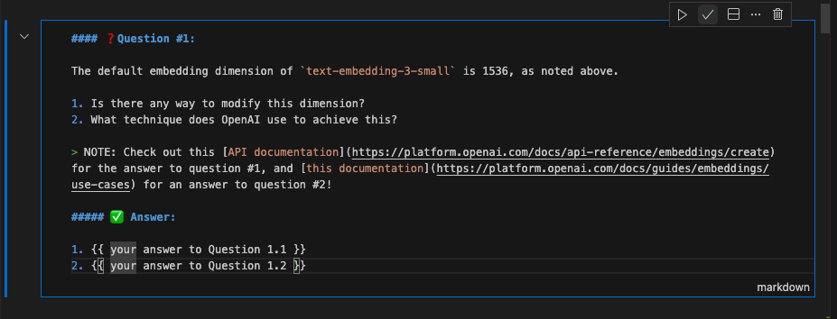

<p align = "center" draggable=”false” >
</p>

## <h1 align="center" id="heading">Session 2: Embeddings and RAG</h1>

### [Quicklinks](https://github.com/AI-Maker-Space/AIE7/tree/main/00_AIM_Quicklinks)

| 🤓 Pre-work | 📰 Session Sheet | ⏺️ Recording     | 🖼️ Slides        | 👨‍💻 Repo         | 📝 Homework      | 📁 Feedback       |
|:-----------------|:-----------------|:-----------------|:-----------------|:-----------------|:-----------------|:-----------------|
| [Session 2: Pre-Work](https://www.notion.so/Session-2-Embeddings-Retrieval-Augmented-Generation-RAG-21dcd547af3d804f8e6af2f18de502e6?source=copy_link#21dcd547af3d80669f17d9dcc363199b)| [Session 2: Embeddings, Retrieval Augmented Generation (RAG)](https://www.notion.so/Session-2-Embeddings-Retrieval-Augmented-Generation-RAG-21dcd547af3d804f8e6af2f18de502e6) | Coming soon! | [Session 2: Vibe Check](https://www.canva.com/design/DAGrSqNpTZ0/xBxCsu2-pKZ6o2RrpLJhOw/view?utm_content=DAGrSqNpTZ0&utm_campaign=designshare&utm_medium=link2&utm_source=uniquelinks&utlId=h8e56a1aacd) | You are here! | [Session 2 Assignment: Embeddings and RAG](https://forms.gle/s3KxEdVL1odqAwCU9) | [AIE7 Feedback 6/26](https://forms.gle/8WW8kXFHM4xb4UHE8)


### Outline:

🤜 BREAKOUT ROOM #1:
- Task 1: Imports and Utilities
- Task 2: Documents
- Task 3: Embeddings and Vectors
- Task 4: Prompts
- Task 5: Retrieval Augmented Generation
     - 🚧 ACTIVITY #1: Augment RAG

### Steps to Run:

1. Install UV - which you can do through [this resource](https://docs.astral.sh/uv/#getting-started)
2. Run the command `uv sync`
3. Open your Jupyter notebook and select `.venv` for your kernel. 

# Build 🏗️

Run the notebook!

# Ship 🚢

- Add one of the following "extras" to the RAG pipeline:
     - Allow it to work with PDF files
     - Implement a new distance metric
     - Add metadata support to the vector database
- Make a simple diagram of the RAG process
- Run the notebook
- Record a Loom walking through the notebook, the questions in the notebook, and your addition!

# Share 🚀
- Show your App in a loom video and explain the diagram
- Make a social media post about your final application and tag @AIMakerspace
- Share 3 lessons learned
- Share 3 lessons not learned

Here's a template to get your post started!

```
🚀 Exciting News! 🎉

I just built and shipped my very first Retrieval Augmented Generation QA Application using Chainlit and the OpenAI API! 🤖💼 

🔍 Three Key Takeaways:
1️⃣ The power of combining traditional search methods with state-of-the-art generative models is mind-blowing. 🧠✨
2️⃣ Collaboration and leveraging community resources like AI Makerspace can greatly accelerate the learning curve. 🌱📈
3️⃣ Dive deep, keep iterating, and never stop learning. Each project brings a new set of challenges and equally rewarding lessons. 🔄📚

A huge shoutout to the @AI Makerspace for their invaluable resources and guidance. 🙌

Looking forward to more AI-driven adventures! 🌟 Feel free to connect if you'd like to chat more about it! 🤝

#OpenAI #AIPowered #Innovation #TechJourney
```

# Submitting Your Homework
Follow these steps to prepare and submit your homework:
1. Create a branch of your `AIE7` repo to track your changes. Example command: `git checkout -b s02-assignment`
2. Answering the questions in the `02_Embeddings_and_RAG/Pythonic_RAG_Assignment.ipynb`notebook:
    + Option 1: Provide your answers in a separate markdown document:
      + Create a markdown document in the `02_Embeddings_and_RAG` folder of your assignment branch (for example "QUESTION_ANSWERS.md"):
      + Copy the questions into the document
      + Answer the question.
    + Option 2: Answer the questions inline in the notebook:
      + Edit the markdown cell with the question in it
      + Create a header (example: `##### ✅ Answer:`) to help the grader find your answer
      + Answer the question
      + Sample: 
      
3. Enhancing your RAG application (🏗️ Activity #1):
    + "your RAG application" refers to the code cells of this notebook, as well as the `aimakerspace` library.
    + At the end of the file is a Python code cell where you will enter the code to enhance the application
    + If you so desire, you can also implement some of the code in new `.py` files and `import` the functionality into that final code cell.
4. Commit and push all of your changes to your origin repository.
>(REMINDER: You should not merge the assignment branch into origin's main branch. This will spare you from future challenges when you pull the new content for each session.)

When submitting your homework, provide the GitHub link to the `02_Embeddings_and_RAG` folder _**of your assignment branch**_. To get the correct link:
+ Go to the code page of your `AIE7` repo:
+ Change the branch dropdown from `main` to the name of the branch you created in Step 1 above.
+ Select the `02_Embeddings_and_RAG` folder
+ Copy the current URL from your browser and paste it into your Homework submission form.

# Query Preprocessing

**Description:**  
Before embedding queries for vector search, the system now preprocesses the input text to improve retrieval accuracy. This includes:

- **Stop Word Removal:**  
  Common English stop words (such as "the", "is", "and", etc.) are automatically removed from queries using the NLTK stopwords corpus. This helps focus the search on the most meaningful terms.

- **(Optional) Synonym Expansion:**  
  Queries can be expanded with synonyms to improve recall. (Enable or customize as needed.)

**How it works:**  
When a query is submitted for search, it is first cleaned by removing stop words. The cleaned query is then embedded and used for similarity search in the vector database.

**Dependencies:**  
- [NLTK](https://www.nltk.org/) is required for stop word removal.  
  The system will automatically check for and download the required NLTK stopwords corpus if it is not already present.

**Example Usage:**
```python
# Example query before preprocessing:
query = "What is the best way to learn about artificial intelligence?"

# After preprocessing (stop words removed):
# "best way learn artificial intelligence"
```

**Benefits:**  
- Improved retrieval accuracy by focusing on key terms.
- More relevant search results for user queries.

# Multi-Format Document Support

**Description:**  
The `TextFileLoader` class now supports loading and parsing multiple document formats, expanding its utility beyond plain text files.

**Supported Formats:**
- **TXT**: Plain text files
- **PDF**: Extracts text from each page using `pdfplumber`
- **DOCX**: Extracts text from Microsoft Word documents using `docx2txt`
- **HTML**: Converts HTML content to plain text using `html2text`

**How it works:**
- When you provide a file path to `TextFileLoader`, it will automatically detect the file type and use the appropriate parser.
- If you provide a directory, all `.txt` files in the directory (and subdirectories) will be loaded.

**Example Usage:**
```python
from aimakerspace.text_utils import TextFileLoader

# Load a TXT, PDF, DOCX, or HTML file
loader = TextFileLoader("path/to/your/file.pdf")  # or .txt, .docx, .html
loader.load()
documents = loader.documents  # List of loaded text content
```

**Dependencies:**
- `pdfplumber`
- `docx2txt`
- `html2text`
- `nltk` (for text preprocessing)

Install all dependencies with:
```bash
pip install pdfplumber docx2txt html2text nltk
```

**Note:**
If you encounter issues with missing NLTK stopwords, the loader will attempt to download them automatically.
